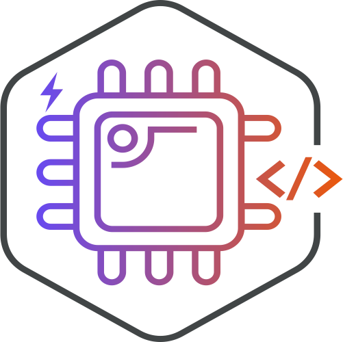
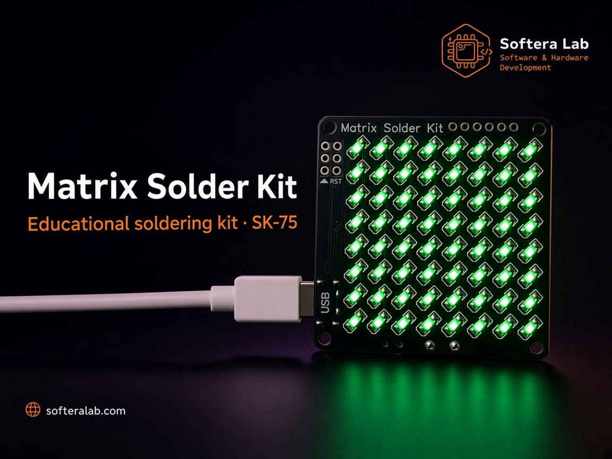
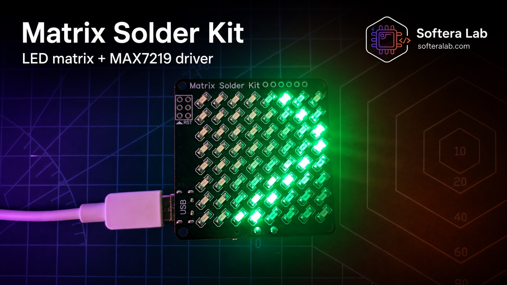
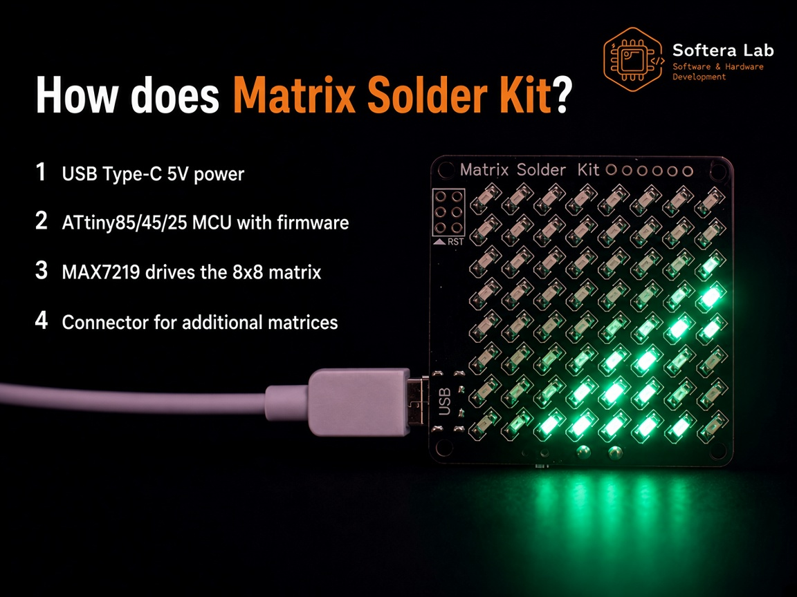
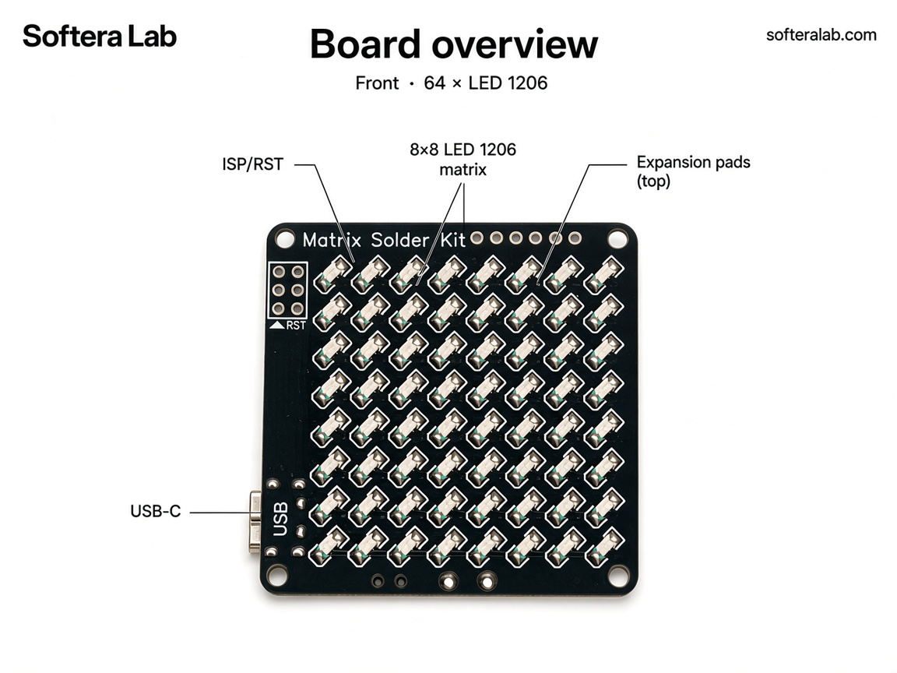
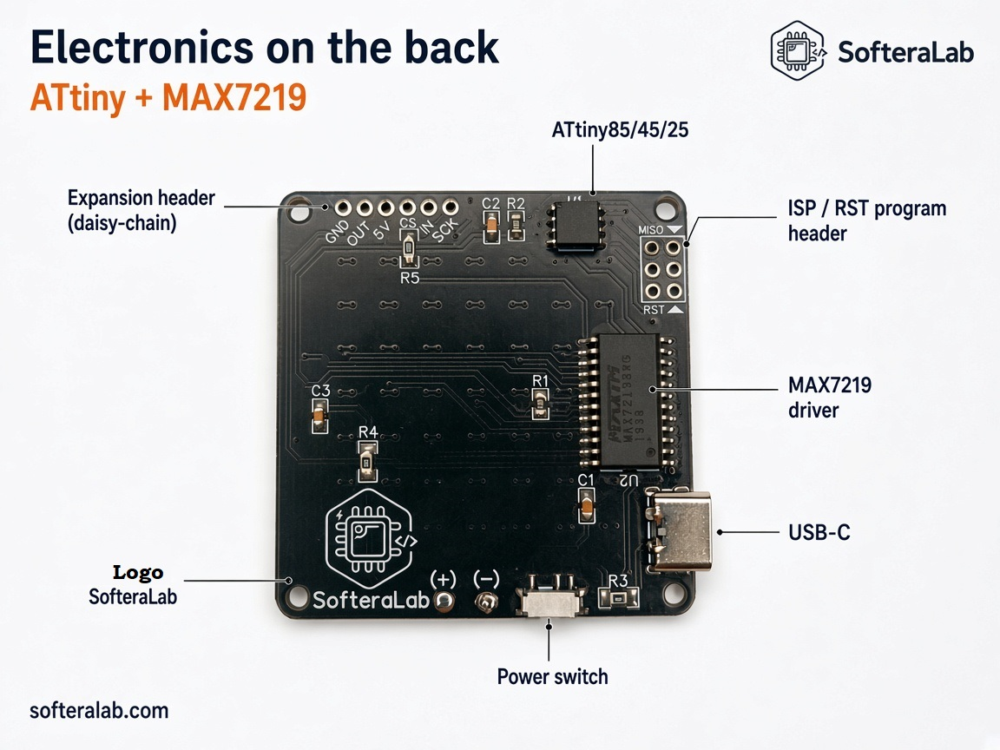
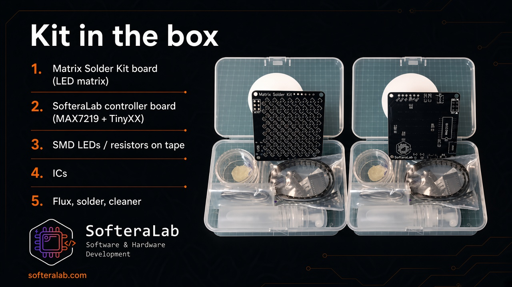
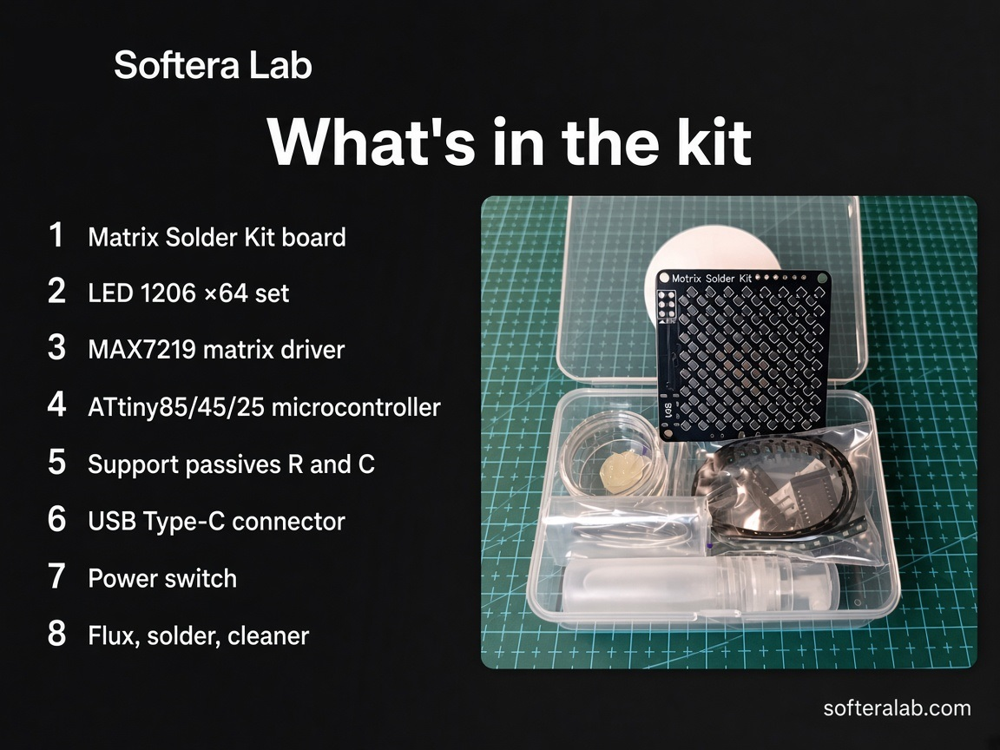
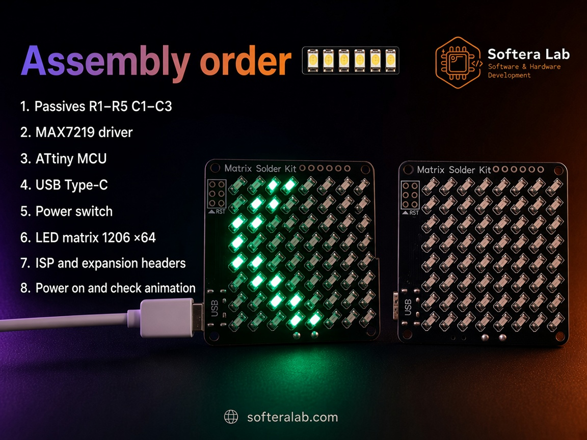
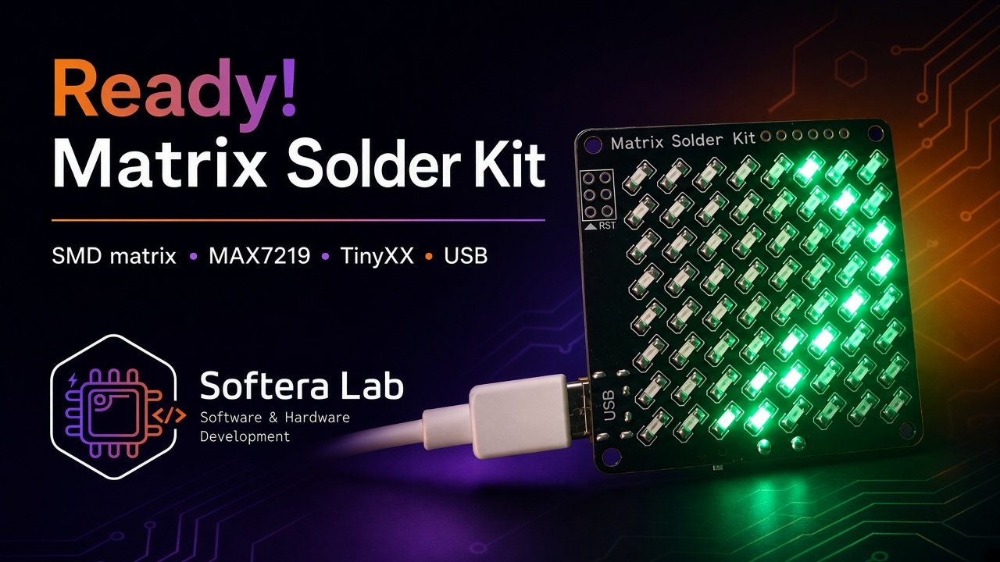

  

<h1 align="center">Matrix Solder Kit · SK-75</h1>

<strong>Softera Lab 8×8 LED matrix soldering kit — ATtiny + MAX7219 · LED 1206</strong>

  
  
  
  
  

<strong>Languages:</strong> English (this page) · <a href="README.uk.md">Українська</a>

  

  

Softera Lab kit for practicing SMD soldering on a real **8×8 LED matrix**. After assembly the board runs demo animations from an **ATtiny** MCU through a **MAX7219** driver. This repository is a **product page and assembly guide** for buyers and [soldering course](https://www.softeralab.com/course-basic-soldering/) students.

This is **not an open-source hardware project**. Schematics source, Gerbers, and manufacturing files are not published.

> © Softera Lab. All rights reserved. Copying the board, schematic, or manufacturing files without written permission is prohibited.

## How it works

  

1. **USB Type-C** — 5 V power  
2. **ATtiny85 / 45 / 25** — MCU with demo firmware  
3. **MAX7219** — drives the **8×8** (64) **LED 1206** matrix  
4. **Expansion header** — daisy-chain extra matrices when needed  
5. **ISP / RST header** — reprogram the MCU  

## About the kit

**Matrix Solder Kit SK-75** is a double-sided practice board from [Softera Lab](https://www.softeralab.com/).

| Zone | What you get |
| --- | --- |
| **LED matrix** | 64 × SMD **LED 1206**, grid **8×8** |
| **Driver** | **MAX7219** LED matrix driver |
| **MCU** | **ATtiny85 / ATtiny45 / ATtiny25** (SOIC-8) |
| **Power** | USB Type-C, 5 V + power switch |
| **Programming** | Separate **ISP / RST** header for MCU reprogramming |
| **Expansion** | Header to connect **additional matrices** (daisy-chain) |

Step-by-step assembly: [`docs/en/`](docs/en/).

  

  

## Specifications

| Parameter | Value |
| --- | --- |
| Product | Matrix Solder Kit · SK-75 |
| Matrix | 8×8 · 64 × LED **1206** |
| Driver | MAX7219 |
| MCU | ATtiny85 / 45 / 25 |
| Input | USB Type-C, 5 V |
| Programming | ISP header (RST / MISO / …) |
| Expansion | Pads for extra matrix (GND, OUT, 5V, CS, IN, SCK) |
| Firmware | Demo animation on the board; reprogrammable |

## What's in the kit

  

  

1. Matrix Solder Kit PCB  
2. LED set **1206** × 64  
3. **MAX7219** matrix driver  
4. **ATtiny85 / 45 / 25** microcontroller  
5. Support passives (R, C)  
6. USB Type-C connector  
7. Power switch  
8. Flux, solder, board cleaner  

## Circuit & multiplexing

Training cards: how **MAX7219** drives the matrix over SPI, how **DIG/SEG** multiplexing works, and the full block diagram including an optional second matrix.

  

  

  

More detail: [docs/en/05-circuit.md](docs/en/05-circuit.md).

## Assembly (short)

Full guide: [docs/en/02-getting-started.md](docs/en/02-getting-started.md).

  

1. Passives **R1–R5**, **C1–C3**  
2. **MAX7219** driver  
3. **ATtiny** MCU  
4. USB Type-C  
5. Power switch  
6. LED matrix **1206** × 64 (observe polarity)  
7. ISP and expansion headers  
8. Power on → check animation  

## Daisy-chain

The board supports **additional matrices** through the expansion header. Connect **OUT → IN** to cascade boards (up to **8**). Power and serial lines follow the silkscreen (**GND · OUT · 5V · CS · IN · SCK**).

  

## Links

| Item | Where |
| --- | --- |
| Ukrainian README | [README.uk.md](README.uk.md) |
| Board overview | [docs/en/01-hardware-overview.md](docs/en/01-hardware-overview.md) |
| Assembly | [docs/en/02-getting-started.md](docs/en/02-getting-started.md) |
| Soldering LEDs | [docs/en/03-soldering.md](docs/en/03-soldering.md) |
| Troubleshooting | [docs/en/04-troubleshooting.md](docs/en/04-troubleshooting.md) |
| Circuit cards | [docs/en/05-circuit.md](docs/en/05-circuit.md) |
| Website | [softeralab.com](https://www.softeralab.com/) |
| Soldering course | [course page](https://www.softeralab.com/course-basic-soldering/) |
| Contact | [Contacts](https://www.softeralab.com/our-contacts/) · support@softeralab.com |
| Instagram | [instagram.com/softeralab](https://www.instagram.com/softeralab/) |
| YouTube | [youtube.com/@SofteraLab](https://www.youtube.com/@SofteraLab) |

## Copyright

© Softera Lab. All rights reserved.

Public materials may be viewed. You may not copy, manufacture, redistribute, or commercially use the board design without written permission from Softera Lab.
