

  

<h1 align="center">Matrix Solder Kit · SK-75</h1>

<strong>Навчальний набір Softera Lab — матриця 8×8 LED 1206 · ATtiny + MAX7219</strong>

  
  
  
  
  

<strong>Мови:</strong> <a href="README.md">English</a> · Українська (ця сторінка)

  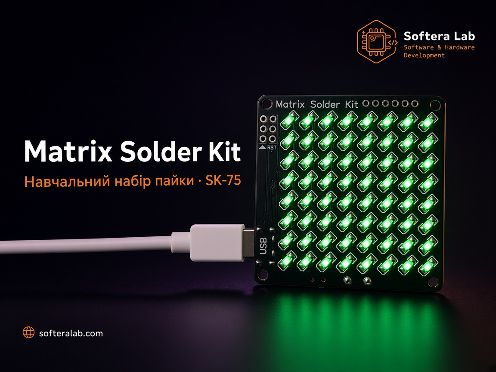

  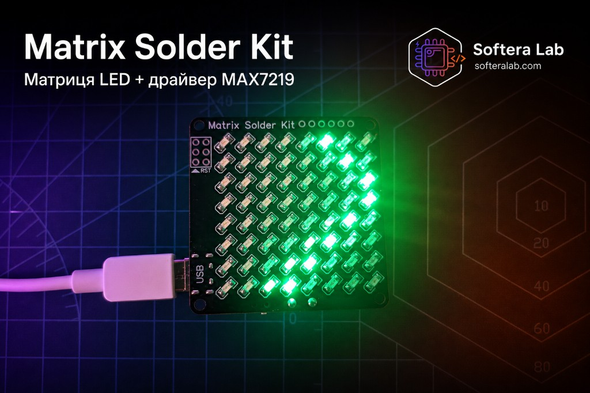

Набір Softera Lab для практики SMD-пайки на реальній **матриці 8×8 LED**. Після збірки плата показує демо-анімацію з **ATtiny** через драйвер **MAX7219**. Це **сторінка продукту та інструкція** для покупців і студентів [курсу пайки](https://www.softeralab.com/course-basic-soldering/).

Це **не open-source проєкт**. Джерела схеми, Gerber і виробничі файли публічно не викладаються.

> © Softera Lab. All rights reserved. Копіювання плати, схеми та виробничих файлів без письмового дозволу заборонене.

## Як працює

  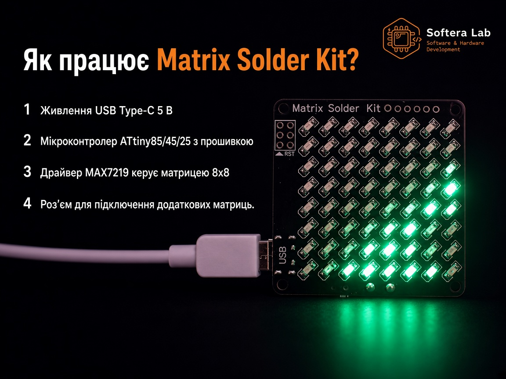

1. **USB Type-C** — живлення 5 В  
2. **ATtiny85 / 45 / 25** — МК із демо-прошивкою  
3. **MAX7219** — керує матрицею **8×8** (64) **LED 1206**  
4. **Роз’єм розширення** — підключення додаткових матриць  
5. **Роз’єм ISP / RST** — перепрограмування МК  

## Про набір

**Matrix Solder Kit SK-75** — двостороння навчальна плата [Softera Lab](https://www.softeralab.com/).

| Зона | Що отримуєте |
| --- | --- |
| **LED-матриця** | 64 × SMD **LED 1206**, сітка **8×8** |
| **Драйвер** | **MAX7219** |
| **МК** | **ATtiny85 / ATtiny45 / ATtiny25** (SOIC-8) |
| **Живлення** | USB Type-C, 5 В + вимикач |
| **Програмування** | Окремий роз’єм **ISP / RST** |
| **Розширення** | Роз’єм для **додаткових матриць** |

Покрокова збірка: [`docs/`](docs/).

  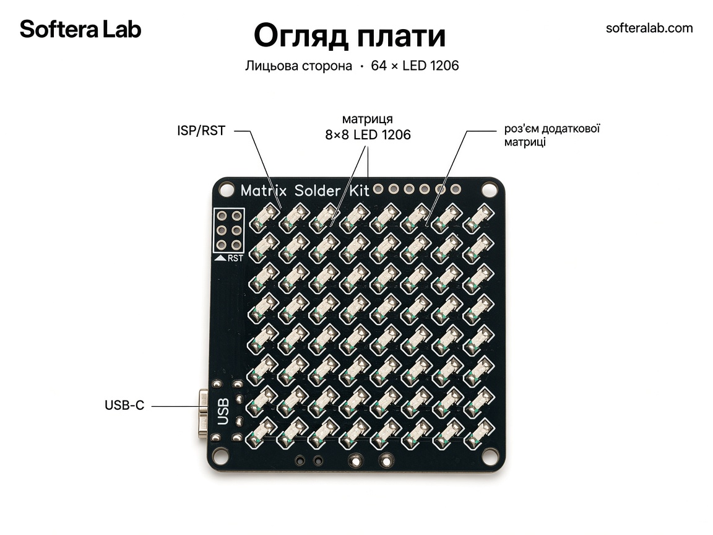

  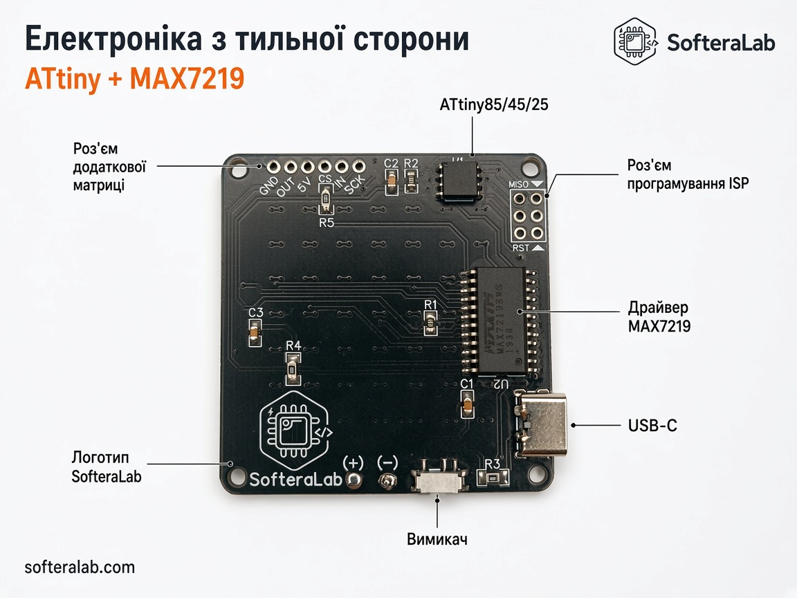

## Характеристики

| Параметр | Значення |
| --- | --- |
| Product | Matrix Solder Kit · SK-75 |
| Матриця | 8×8 · 64 × LED **1206** |
| Драйвер | MAX7219 |
| МК | ATtiny85 / 45 / 25 |
| Вхід | USB Type-C, 5 В |
| Програмування | ISP (RST / MISO / …) |
| Розширення | Площадки додаткової матриці (GND, OUT, 5V, CS, IN, SCK) |
| Прошивка | Демо-анімація на платі; можна перепрограмувати |

## Що в наборі

  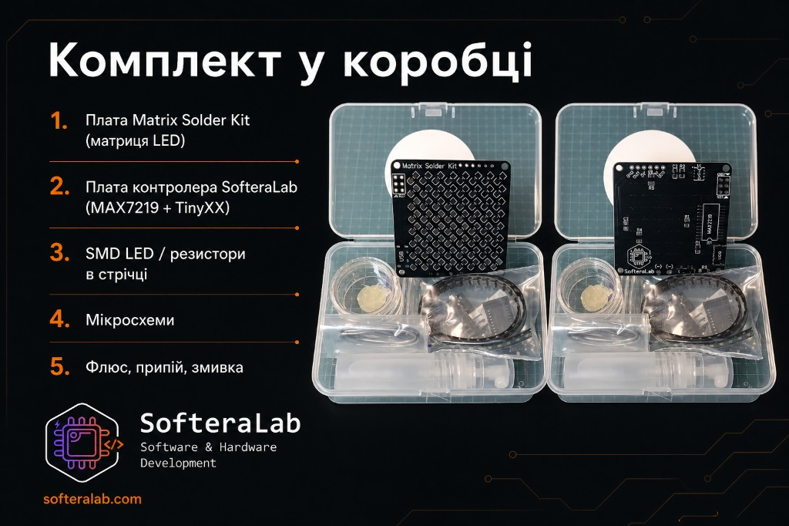

  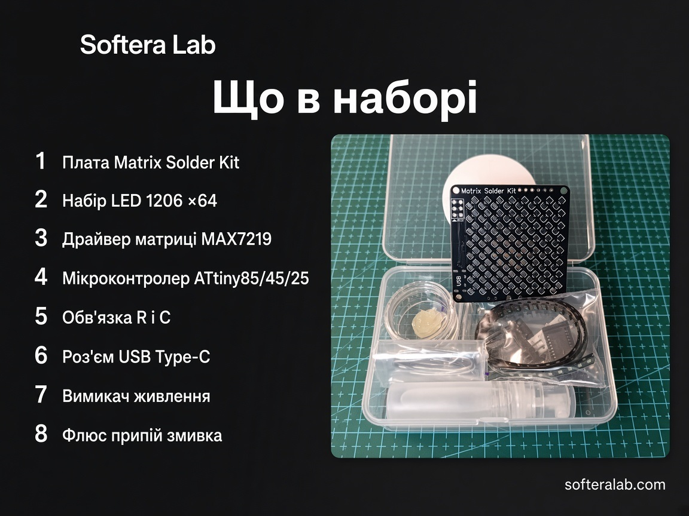

1. Плата Matrix Solder Kit  
2. Набір LED **1206** × 64  
3. Драйвер матриці **MAX7219**  
4. Мікроконтролер **ATtiny85 / 45 / 25**  
5. Обв’язка (R, C)  
6. Роз’єм USB Type-C  
7. Вимикач живлення  
8. Флюс, припій, змивка  

## Схема і мультиплексування

Навчальні картки: як **MAX7219** керує матрицею по SPI, як працює **DIG/SEG**, і повна блок-схема з опційною другою матрицею.

  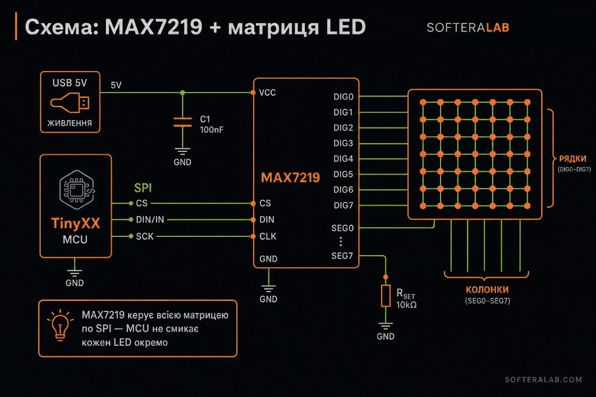

  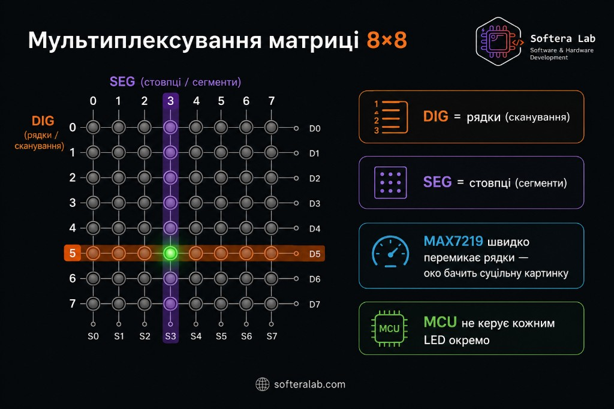

  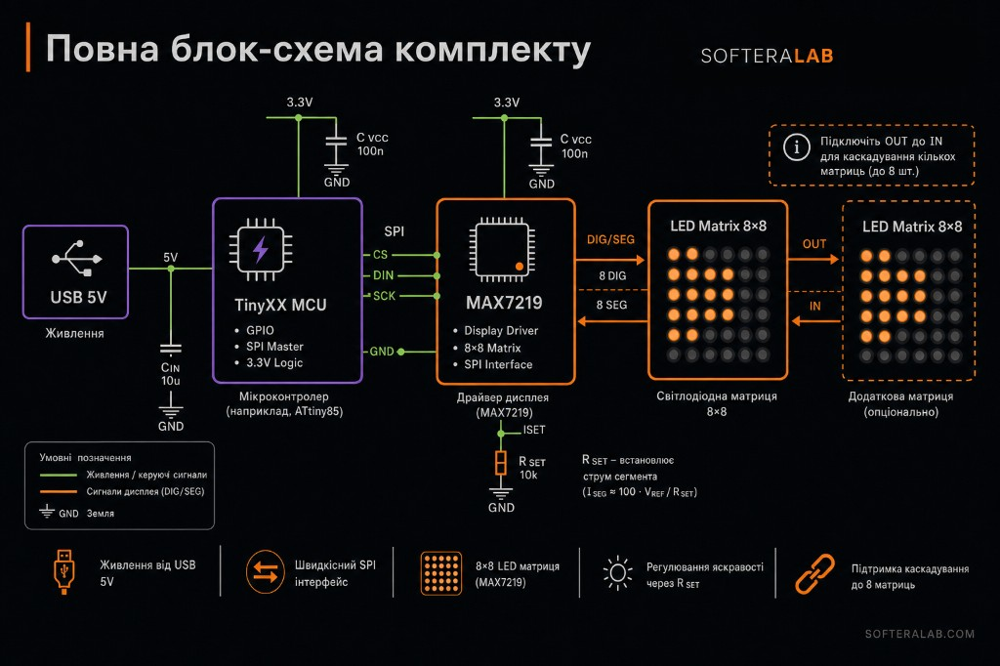

Детальніше: [docs/05-circuit.md](docs/05-circuit.md).

## Збірка коротко

Повний гайд: [docs/02-getting-started.md](docs/02-getting-started.md).

  

1. Пасивні **R1–R5**, **C1–C3**  
2. Драйвер **MAX7219**  
3. МК **ATtiny**  
4. USB Type-C  
5. Вимикач  
6. Матриця LED **1206** × 64 (полярність!)  
7. Роз’єми ISP і розширення  
8. Увімкнути → перевірити анімацію  

## Додаткові матриці

Плата підтримує **підключення додаткових матриць** через роз’єм розширення. З’єднайте **OUT → IN** для каскаду (до **8** шт.). Живлення і лінії — за шовкографією (**GND · OUT · 5V · CS · IN · SCK**).

  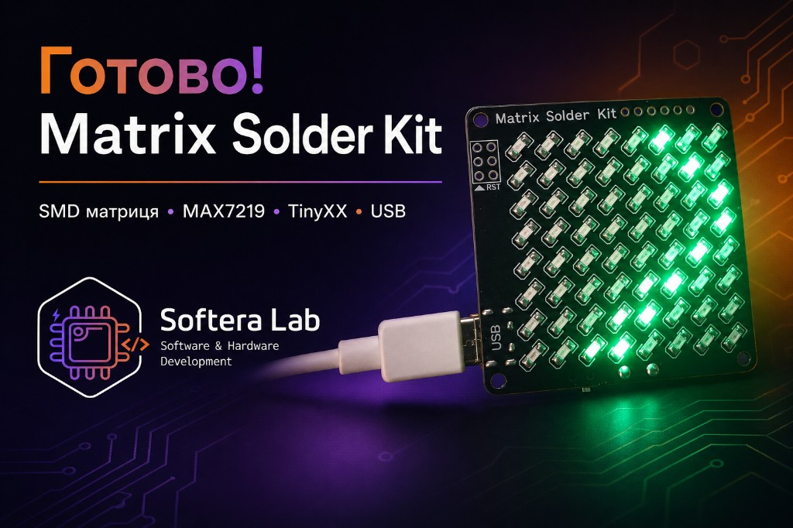

## Прошивка (ATtiny + MAX7219)

Демо-скечі для бортового **ATtiny** у [`firmware/`](firmware/):

| Скетч | Опис |
| --- | --- |
| [SK75_Demo](firmware/SK75_Demo/) | Серце / смайл + дощ, іскри, змійка, сканер |
| [SK75_Patterns](firmware/SK75_Patterns/) | Патерни + м’ячик |
| [SK75_Scroll](firmware/SK75_Scroll/) | Біжучий рядок |

Прошивка через **ISP / RST** (USBasp / Arduino as ISP). SoftSPI за замовчуванням: **DIN→PB0, CS→PB3, CLK→PB2**. Деталі: [firmware/README.uk.md](firmware/README.uk.md).

## Посилання

| Пункт | Куди |
| --- | --- |
| English README | [README.md](README.md) |
| Огляд плати | [docs/01-hardware-overview.md](docs/01-hardware-overview.md) |
| Збірка | [docs/02-getting-started.md](docs/02-getting-started.md) |
| Пайка LED | [docs/03-soldering.md](docs/03-soldering.md) |
| Діагностика | [docs/04-troubleshooting.md](docs/04-troubleshooting.md) |
| Схема і блоки | [docs/05-circuit.md](docs/05-circuit.md) |
| Прошивка | [firmware/README.uk.md](firmware/README.uk.md) |
| Сайт | [softeralab.com](https://www.softeralab.com/) |
| Курс пайки | [сторінка курсу](https://www.softeralab.com/course-basic-soldering/) |
| Контакт | [Контакти](https://www.softeralab.com/our-contacts/) · support@softeralab.com |
| Instagram | [instagram.com/softeralab](https://www.instagram.com/softeralab/) |
| YouTube | [youtube.com/@SofteraLab](https://www.youtube.com/@SofteraLab) |

## Авторські права

© Softera Lab. All rights reserved.

Публічні матеріали можна переглядати. Копіювати, виробляти, розповсюджувати чи комерційно використовувати дизайн плати без письмового дозволу Softera Lab заборонено.
