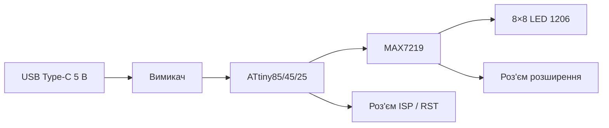

Апаратна частина

# Огляд плати

**Matrix Solder Kit · SK-75** — навчальна плата Softera Lab, яка після збірки стає програмованою LED-матрицею.

## Блок-схема

| Блок | Роль |
| --- | --- |
| USB Type-C | Живлення 5 В |
| ATtiny85 / 45 / 25 | МК із демо-прошивкою; можна перепрограмувати |
| MAX7219 | Драйвер LED-матриці |
| Матриця | 64 × SMD LED **1206**, сітка **8×8** |
| ISP / RST | Окремий роз’єм для перепрограмування МК |
| Розширення | Підключення додаткових матриць |

## Лицьова сторона

| Зона | Вміст |
| --- | --- |
| Центр | Площадки 8×8 під LED 1206 |
| Ліворуч | USB Type-C |
| Верх ліворуч | Роз’єм програмування ISP / RST |
| Верхній край | Площадки додаткової матриці |

## Тильна сторона

| Зона | Вміст |
| --- | --- |
| MAX7219 | Драйвер матриці |
| ATtiny | МК SOIC-8 (85 / 45 / 25) |
| Обв’язка | R1–R5, C1–C3 |
| USB-C + вимикач | Ланцюг живлення |
| Розширення | GND · OUT · 5V · CS · IN · SCK |
| ISP | Роз’єм програмування |

## Комплектація

:::caution Інтелектуальна власність
Публічні матеріали описують роботу купленого набору. Файли KiCad / Gerber у цей репозиторій не входять.
:::
