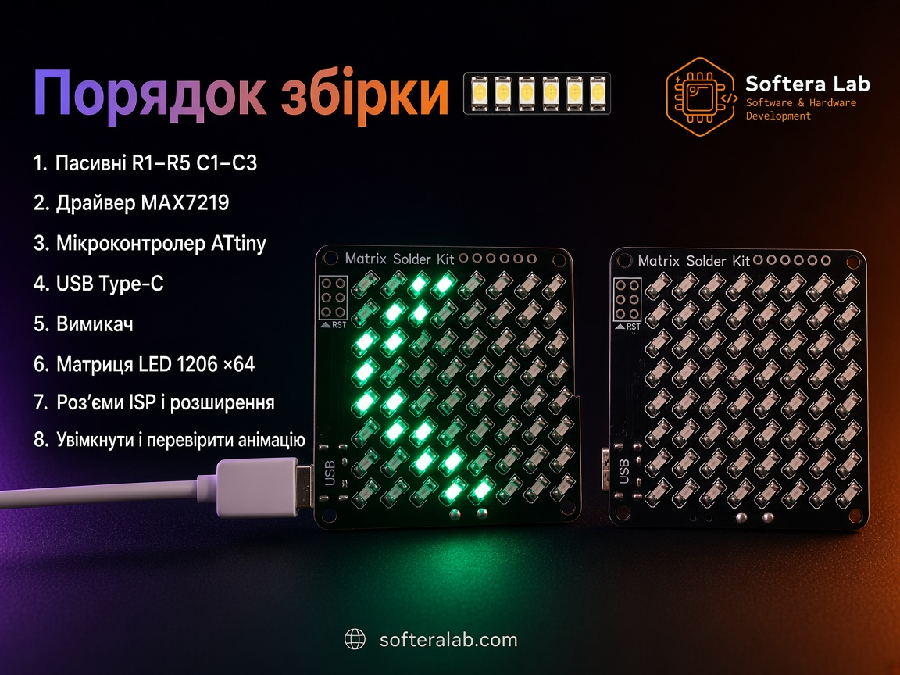
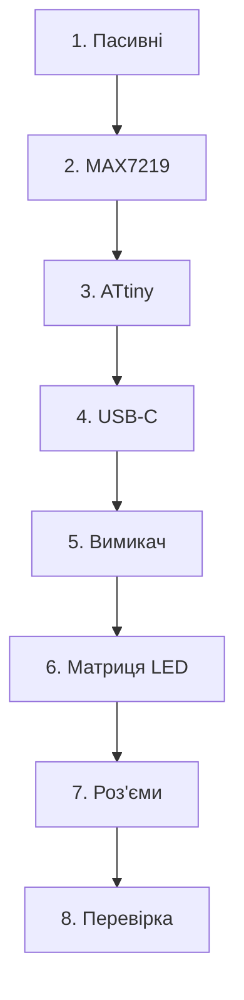

Перший запуск

# Збірка набору

Йдіть за карткою набору. Спочатку пасивні й мікросхеми, потім матриця LED, далі роз’єми і перевірка під живленням.

## Інструменти

- Паяльник ~300–350 °C, тонке жало  
- Антистатичний пінцет  
- Флюс і тонкий припій (0.3–0.5 мм)  
- IPA для змивки  
- Підставка під плату  

## Кроки

| Крок | Дія |
| --- | --- |
| 1 | Припаяти пасивні **R1–R5**, **C1–C3** |
| 2 | Припаяти драйвер **MAX7219** |
| 3 | Припаяти МК **ATtiny** (85 / 45 / 25) — ключ pin 1 |
| 4 | Припаяти **USB Type-C** |
| 5 | Припаяти **вимикач** |
| 6 | Припаяти **LED 1206** × 64 — **полярність** кожного LED |
| 7 | Припаяти роз’єми **ISP** і **розширення** |
| 8 | Увімкнути через USB-C → перевірити демо-анімацію |

:::caution Полярність LED
У кожного LED 1206 є катод. Неправильна орієнтація лишає піксель темним. Звірте з міткою на шовкографії до пайки другого контакту.
:::

:::info Після кроку 8
Техніка пайки LED — у [03-soldering.md](./03-soldering.md). Якщо щось не працює — [04-troubleshooting.md](./04-troubleshooting.md).
:::
