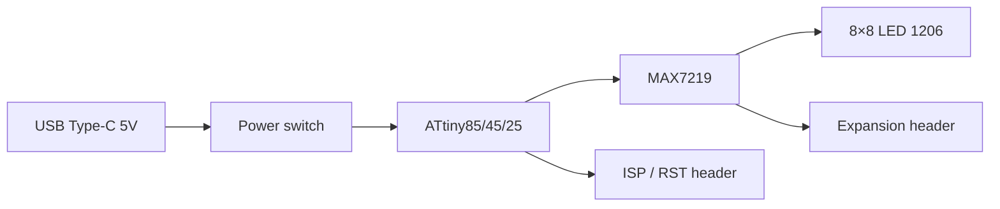

Hardware

# Board overview

**Matrix Solder Kit · SK-75** is a Softera Lab soldering practice board that becomes a programmable LED matrix after assembly.

## Block diagram

| Block | Role |
| --- | --- |
| USB Type-C | 5 V power input |
| ATtiny85 / 45 / 25 | MCU with demo firmware; reprogrammable |
| MAX7219 | LED matrix driver |
| LED matrix | 64 × SMD LED **1206**, grid **8×8** |
| ISP / RST | Separate header to reprogram the MCU |
| Expansion | Daisy-chain additional matrices |

## Front side

| Zone | Contents |
| --- | --- |
| Center | 8×8 footprints for LED 1206 |
| Left | USB Type-C silkscreen / connector |
| Top-left | ISP / RST programming header |
| Top edge | Expansion pads for extra matrix |

## Back side

| Zone | Contents |
| --- | --- |
| MAX7219 | Matrix driver IC |
| ATtiny | SOIC-8 MCU (85 / 45 / 25) |
| Passives | R1–R5, C1–C3 |
| USB-C + switch | Power path |
| Expansion | GND · OUT · 5V · CS · IN · SCK |
| ISP | Programming header |

## Kit contents

:::caution Intellectual property
Public docs describe how to use the purchased kit. KiCad / Gerber files are not part of this repository.
:::
