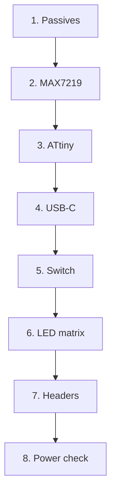

Build

# Assembly

Follow the kit card order. Passives and ICs first, then the LED matrix, then headers and power-on check.

## Tools

- Soldering iron ~300–350 °C, fine tip  
- Antistatic tweezers  
- Flux and thin solder (0.3–0.5 mm)  
- IPA for cleaning  
- Board stand  

## Steps

| Step | Action |
| --- | --- |
| 1 | Solder passives **R1–R5**, **C1–C3** |
| 2 | Solder **MAX7219** driver |
| 3 | Solder **ATtiny** MCU (85 / 45 / 25) — match pin 1 |
| 4 | Solder **USB Type-C** |
| 5 | Solder **power switch** |
| 6 | Solder **LED 1206** × 64 — **polarity** on every LED |
| 7 | Solder **ISP** and **expansion** headers |
| 8 | Power on via USB-C → check demo animation |

:::caution LED polarity
Each 1206 LED has a cathode mark. Wrong orientation leaves that pixel dark. Match the silkscreen “T” / pad mark before soldering the second pad.
:::

:::info After step 8
Use [soldering technique](./03-soldering.md) for LED tips. If something fails, open [troubleshooting](./04-troubleshooting.md).
:::
