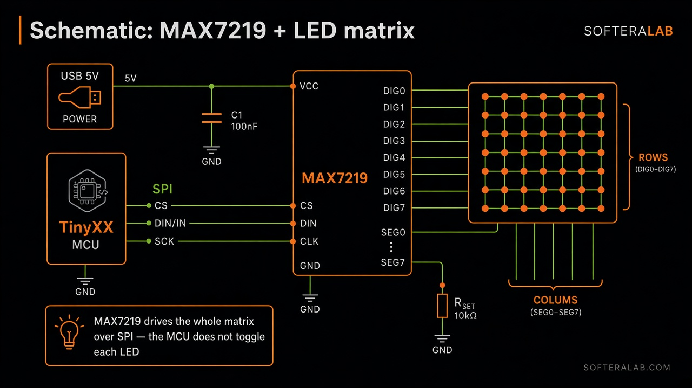
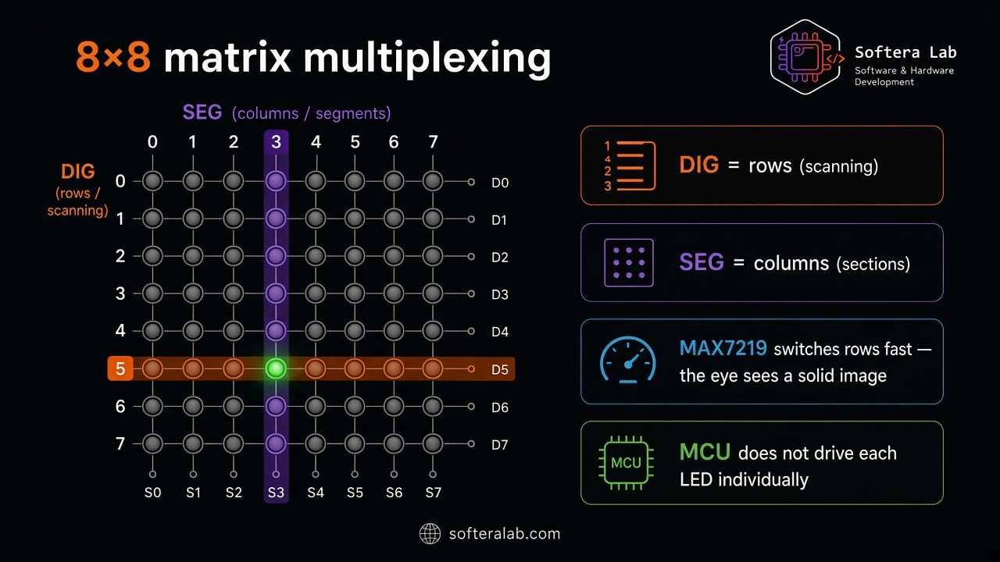
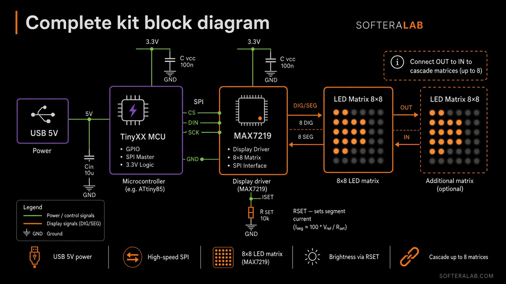

Circuit

# Circuit cards

Training slides for the kit: SPI drive, DIG/SEG multiplexing, and cascading.

## Schematic — MAX7219 + LED matrix

USB **5 V** feeds the **ATtiny** (TinyXX) and **MAX7219**. The MCU talks SPI (**CS · DIN · SCK**). The driver scans the matrix with **DIG0–DIG7** (rows) and **SEG0–SEG7** (columns). **RSET** sets segment current.

## 8×8 multiplexing

- **DIG** = rows (scanning)  
- **SEG** = columns (segments)  
- MAX7219 switches rows fast — the eye sees a solid image  
- The MCU does **not** drive each LED individually  

## Complete block diagram

Cascade extra matrices with **OUT → IN** (up to **8**). Brightness is set via **RSET**.

:::caution Intellectual property
These cards explain the purchased kit. Full manufacturing schematics and Gerbers are not published.
:::
